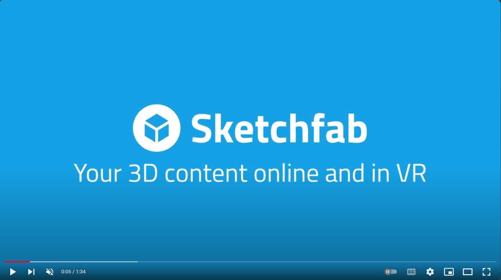
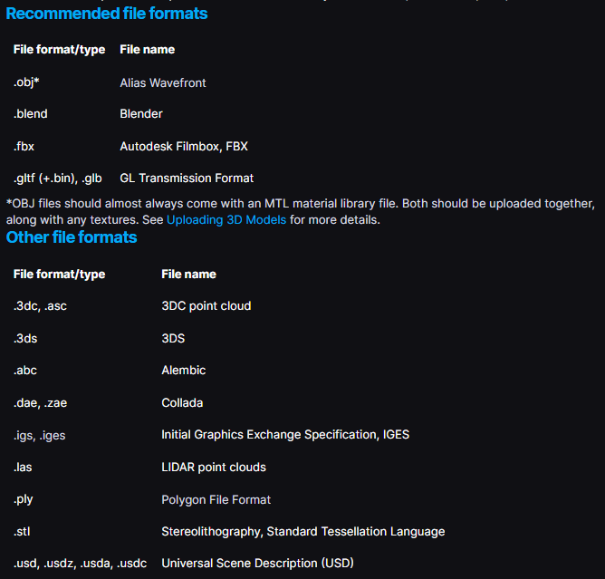

# What is SketchFab?

Sketchfab is a powerful online platform that allows users to upload, share, and explore 3D models in an interactive way. Whether you're an artist, designer, or enthusiast, Sketchfab provides a dynamic space to showcase your creations and discover others' work. With its intuitive interface and extensive community, Sketchfab makes 3D content accessible and engaging. Watch this [video](https://www.youtube.com/watch?v=HsC08YcWBug) to see all the features Sketchfab has to offer!

# How to use SketchFab?

## Exploring 3D models

1. Open your browser and type https://sketchfab.com/ in the address bar.
2. You can explore different categories of 3D models or use the search bar to search for a certain model.

## Uploading 3D models

To upload your own 3D models to Sketchfab, you need to create an account first.

When you have an account, you can upload any 3D model in any of the following formats.

## Annotating 3D models

In the upload page, you can add annotations to your model by editing the model as shown below. You can double click on any part of the model to add an annotation at the clicked part.

The camera angle is saved with the annotation. Every time you click on the annotation, the camera will moved to the predefined angle for that annotation.

## Embedding 3D models as html element

